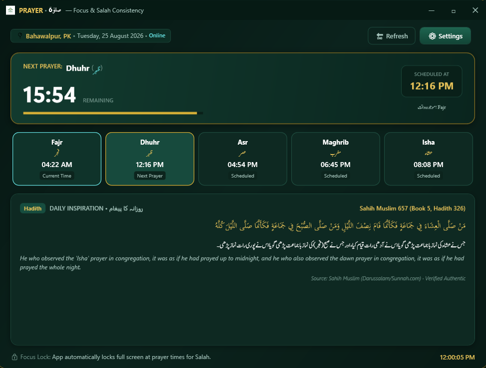
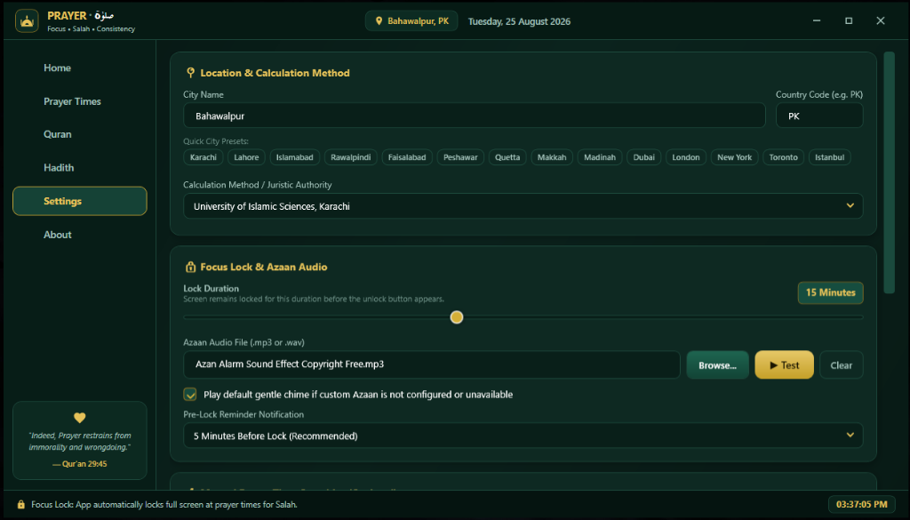

# 🕌 Prayer (صلوٰۃ) — Windows Salah Focus Lock

> *"Your screen waits. Salah doesn't."*

---

## 📸 Screenshots

| 🕌 Live Dashboard | ⚙️ Settings & Customization | 🔒 Fullscreen Focus Lock |
| :---: | :---: | :---: |
|  |  |  |

---

## 📖 About Prayer

In our modern, fast-paced work and digital environments, it is easy to get immersed in tasks and unintentionally delay our daily prayers (**Salah**). 

**Prayer** is a dedicated Windows desktop application created to help Muslims build steadfast discipline and consistency in their worship. When each of the five daily prayer times arrives (**Fajr, Dhuhr, Asr, Maghrib, Isha**), the application locks your computer screens with a beautiful, distraction-free overlay for a configurable duration (default 15 minutes), allowing you to step away from work, perform Wudu, and offer Salah with complete peace of mind.

---

## ✨ Key Features

- **🌐 Automatic Prayer Times & Offline Caching**: Accurately calculates prayer times worldwide via the Aladhan API, automatically caching monthly schedules in a local SQLite database for seamless offline operation.
- **🔒 Multi-Monitor Fullscreen Focus Lock**: At prayer time, all connected monitors are covered with an unclosable focus screen, playing your chosen Azaan or chime. The unlock button is safely revealed once the prayer duration elapses.
- **⏰ 5-Minute Pre-Lock Reminder Notifications**: Receive a gentle native Windows toast notification 5 minutes before each prayer, allowing you to save your work before the lock engages.
- **✍️ Manual Jamat Overrides**: Easily adjust individual prayer times using explicit 12-Hour (Hour, Minute, AM/PM) pickers to match your local neighborhood mosque's Jamat schedule.
- **📖 Daily Quran Ayat & Sahih Hadith**: Every day features an inspiring Ayah from the Quran (Arabic text with English & Urdu translations) alongside authenticated Hadith strictly sourced from **Sahih al-Bukhari** and **Sahih Muslim**.
- **🎨 Premium Dark & Light Themes**: Crafted with a custom title bar, dark emerald and warm gold Islamic accents, glassmorphic cards, and Urdu/Arabic typography.
- **🔊 Custom Azaan Audio**: Select your own `.mp3` or `.wav` Azaan recording or use the built-in gentle prayer chime.
- **🛡️ Sleep & Wake Resilience**: Automatically calculates real-world elapsed time if your laptop goes to sleep or is closed during a lock session.
- **🚀 System Tray Integration & Autostart**: Runs unobtrusively in the Windows system tray with a custom right-click flyout menu and optional Windows startup launch.

---

## 📥 Download & Installation

1. Go to the [**Releases**](https://github.com/itsrananoman/Prayer-App/releases) page on GitHub.
2. Download the latest installer: `PrayerSetup_v1.1.0.exe`.
3. Double-click the installer and follow the guided setup wizard.
4. Launch **Prayer** from your Desktop or Start Menu.

> **System Requirements**:  
> • Windows 10 (64-bit) or Windows 11  
> • Administrator privileges are requested during installation to enable system-level focus locking and startup integration.

---

## 🛠️ Tech Stack

- **Language & UI**: C# 12, .NET 8 (WPF — Windows Presentation Foundation)
- **Architecture**: MVVM (Model-View-ViewModel) pattern with Dependency Injection
- **Database**: SQLite with Entity Framework Core (Code-First)
- **Audio & Media**: DirectSound / Windows Media Player COM Interop
- **Packaging**: Inno Setup 6 Compiler (Self-Contained single-file deployment)
- **Web Services**: Aladhan Timings API & Al-Quran Cloud API

---

## 📜 License

All Rights Reserved © 2026 **DevCrafters**.  
This software is proprietary. Redistribution, unauthorized copying, or modification without explicit written permission from the developer is not permitted.

---

## 👥 Credits & Attributions

- **Lead Developer**: [Rana Noman](https://github.com/itsrananoman) — *DevCrafters*
- **Prayer Times Data**: [Aladhan API](https://aladhan.com/prayer-times-api)
- **Quranic Text & Translations**: [Tanzil Project & Al-Quran Cloud](https://alquran.cloud/)
- **Hadith Collections**: Verified authentic narrations from *Sahih al-Bukhari* and *Sahih Muslim*

---

## 💬 Contact & Support

If you encounter any issues, have feature suggestions, or wish to provide feedback:
- 🐛 [**Open an Issue on GitHub**](https://github.com/itsrananoman/Prayer-App/issues)
- ✉️ Contact developer via [DevCrafters / Rana Noman](https://github.com/itsrananoman)
