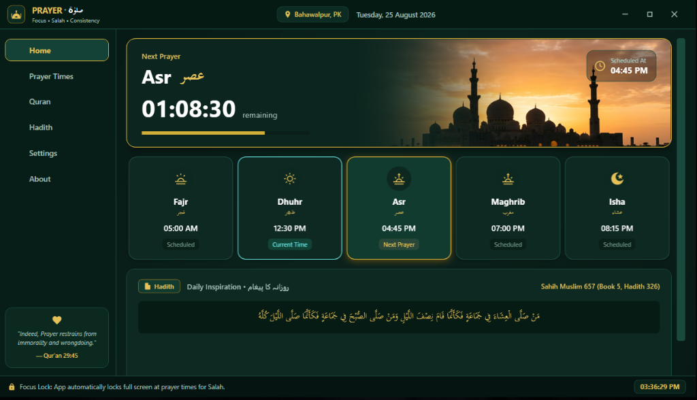
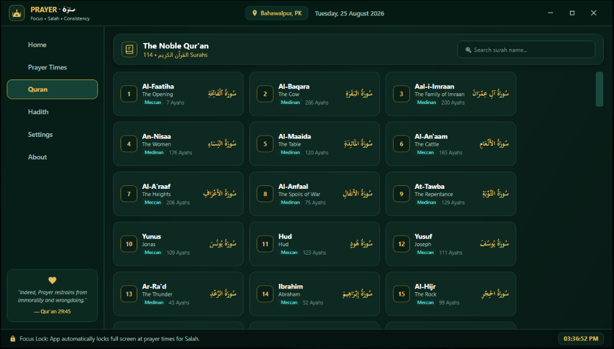

# 🕌 Prayer (صلوٰۃ) — Windows Salah Focus Lock & Islamic Companion

> *"Your screen waits. Salah doesn't."*

---

## 📸 Screenshots

| 🏠 Home | 📖 Quran Reader | ⚙️ Settings |
| :---: | :---: | :---: |
|  |  |  |

---

## 📖 About Prayer

In our modern, fast-paced work and digital environments, it is easy to get immersed in tasks and unintentionally delay our daily worship. 

**Prayer** is a comprehensive Windows desktop companion designed to help Muslims maintain steadfast consistency in **Salah**. When prayer times arrive (**Fajr, Dhuhr, Asr, Maghrib, Isha**), the application locks your computer screens with a distraction-free overlay for a configurable duration (default 15 minutes) to step away for Wudu and prayer. In addition to focus locking, **Prayer v2.0.0** includes a full offline-capable Quran reader across all 114 Surahs and authenticated daily Hadith narrations.

---

## ✨ Key Features

- **📖 Full Quran Reader**: Browse all 114 Surahs with crystal-clear Arabic (Uthmani script), Urdu (Fateh Muhammad Jalandhry), and English (Saheeh International) translations.
- **⚡ Offline-First Quran Caching**: Opened Surahs and the 114-Surah directory are cached in a local SQLite database for instant, offline reading.
- **🔖 Bookmark & Resume Reading**: Remembers your last-read Ayah per Surah with convenient continue prompts.
- **🧭 Multi-Page Navigation Shell**: Seamless sidebar navigation between Home, Prayer Times, Quran, Hadith, Settings, and About.
- **🕌 Modern Emerald & Gold Visual Design**: Beautiful Islamic aesthetics featuring vector iconography, live countdowns, and rich mosque sunset artwork.
- **🔒 Multi-Monitor Fullscreen Focus Lock**: At prayer time, all connected monitors are covered with an unclosable focus screen, playing your chosen Azaan or chime.
- **⏰ 5-Minute Pre-Lock Reminder Notifications**: Native Windows toast notification prior to each prayer lock, giving you time to save ongoing work.
- **🌐 Automatic Prayer Times & Calculations**: Worldwide prayer calculations via Aladhan API with automatic offline SQLite caching.
- **✍️ Manual Jamat Overrides**: Adjust individual prayer times with 12-Hour (Hour, Minute, AM/PM) pickers to match your local mosque's Jamat schedule.
- **📜 Verified Authentic Hadith Inspiration**: Daily Hadith narrations strictly restricted to **Sahih al-Bukhari** and **Sahih Muslim** with full citations.
- **🔊 Custom Azaan Audio**: Select custom `.mp3` or `.wav` Azaan recordings or use the built-in gentle prayer chime.
- **🛡️ Sleep & Wake Resilience**: Accurately tracks elapsed prayer time if your system sleeps or is closed during a lock session.
- **🚀 System Tray Integration**: Runs quietly in the Windows system tray with a custom right-click flyout menu and optional Windows startup launch.

---

## 📥 Download & Installation

1. Go to the [**Releases**](https://github.com/itsrananoman/Prayer-App/releases) page on GitHub.
2. Download the latest installer: `PrayerSetup_v2.0.0.exe`.
3. Double-click the installer and follow the guided setup wizard.
4. Launch **Prayer** from your Desktop or Start Menu.

> **System Requirements**:  
> • Windows 10 (64-bit) or Windows 11  
> • Administrator privileges are requested during installation to enable system-level focus locking and startup integration.

---

## 🛠️ Tech Stack

- **Language & UI**: C# 12, .NET 8 (WPF — Windows Presentation Foundation)
- **Architecture**: MVVM (Model-View-ViewModel) pattern with Dependency Injection
- **Database**: SQLite with Entity Framework Core (Code-First & Auto-Migrations)
- **Audio & Media**: DirectSound / Windows Media Player COM Interop
- **Packaging**: Inno Setup 6 Compiler (Self-Contained single-file deployment)
- **Web Services**: Aladhan Timings API & Al-Quran Cloud API (Tanzil Project)

---

## 📜 License

All Rights Reserved © 2026 **DevCrafters**.  
This software is proprietary. Redistribution, unauthorized copying, or modification without explicit written permission from the developer is not permitted.

---

## 👥 Credits & Attributions

- **Lead Developer**: [Rana Noman](https://github.com/itsrananoman) — *DevCrafters*
- **Prayer Times Data**: [Aladhan API](https://aladhan.com/prayer-times-api)
- **Quranic Text & Translations**: Quran text via Tanzil Project ([alquran.cloud](https://alquran.cloud/))
- **Hadith Collections**: Verified authentic narrations from *Sahih al-Bukhari* and *Sahih Muslim*

---

## 💬 Contact & Support

If you encounter any issues, have feature suggestions, or wish to provide feedback:
- 🐛 [**Open an Issue on GitHub**](https://github.com/itsrananoman/Prayer-App/issues)
- ✉️ Contact developer via [DevCrafters / Rana Noman](https://github.com/itsrananoman)
